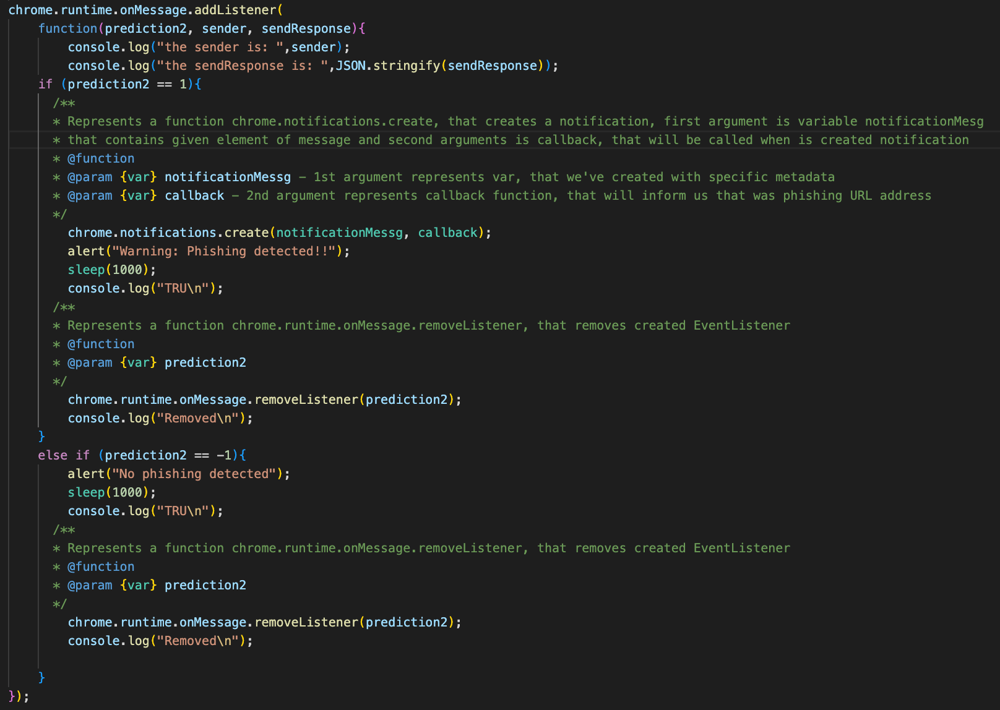

# Heuristic detection of phishing attacks

This master thesis aims to develop an architecture for automated heuristic phishing detection. The outcome of this approach is to evaluate phishing URLs using an automated solution.

[Master Thesis](https://opac.crzp.sk/?fn=detailBiblioForm&sid=7950E184AA7EAF4CBD88F943086F)

## Heuristic detection of phishing attacks

Repository contains the automated detection of phishing URLs, the automated detection is realized by the implementation of Java Web Server that uses ChromeDriver and Selenium testing framework, malicious URLs are in CSV data sets, heuristic detection aims to test phishing URLs during website surfing, 
I've implemented web browser extension that can test malicious URL per URL with the usage of automation and usage Selenium testing framework, the browser extension contains the predict() functions that contains twenty methods for testing purposes to identify if the proper URL contains some specific characteristics for phishing URLS, every function has some weight that is calculated in final weight to definy if it is phishing URL or not.

I've also created a not automated version when you can test manually, with the same Java Web Sever implementation mentioned above URLS but without usage of large datasets and you can safely test in ChromeDriver environment
exact URLs. 

Testing fuctions to detect phishing URLs with the possible returning values:

```
IsIPv4() (-1|+1)
isHttps() (-1|+1)
isTildeInURL() (-1|+1)
isHashTaginURL() (-1|+1)
isLongURL(<54,54-75,75>) (-1|0|+1)
isTinyURL() (-1|+1)
isRedirectingURL() (-1|+1)
isHypenURL() (-1|+1)
isMultiDomain() (-1|+1)
isFaviconDomainUnidentical() (-1|+1)
isIllegalHttpsURL() (-1|+1)
isImgFromDifferentDomain() (-1|0|+1)
isAnchorFromDifferentDomain() (-1|0|+1)
isScLnkFromDifferentDomain() (-1|0|+1)
isFormActionInvalid() (-1|0|+1)
isMailToAvailable() (-1|+1)
isIframePresent() (-1|+1)
getIdenticalDomainCount() (returns IdenticalDomainCount number)
```

Phishing URL web detection based on weight implemented in web browser extensions:



This repository contains the source codes for the master thesis. 

Directory `logic/` contains the source code for 1st
version of extension for web browser Google Chrome.
There are proper `.crx file` and `private key` in .pem.

Directory `Package/` contains the source code for 2nd
version of extension for web browser Google Chrome. 
There are proper `.crx file` and `private key` in .pem.

Directory `project/` contains the Java Spring Boot project
that enables testing where you can define to test 1 URL address 
or you can define more url addresses with variables and pass it to
Selenium Framework and you test it with two versions of web browser extensions
that was mentioned above.

Directory `Automated/` contains the Java Spring Boot project 
that enables also testing but in this folder testing is testing with CSV file, 
where are stored phishing URL addresses and there is and 10s delay between 
testing URL address per URL address. 

## System requirements:
IntelliJ Idea Ultimate or any other IDE that supports Spring Boot \
Java JDK 17 \
Maven v3.8.5 \
Node JS 16.14.2 \
ChromeDriver

# Documentation:
Documentations for web browser extenstions is in every specific 
folder that was mentioned in text higher. 

Documentation for every web browser extension is in folder jsdoc/

## How to compile JS documentation: 


Open terminal and open Visual Studio Code for any
other text editor and then update some comments in source code.

`$ cd jsdoc/out/scripts/; code .`

Open second terminal and go to the proper directory:

`$ cd jsdoc/out/scripts/`

Regenerate HTML pages after some changes and choose file that
you have updated: 

for example: 

`$ jsdoc doc.json extenstionListener.js`

or

`$ jsdoc doc.json logic2.js`

## Documentation for every version of web browser extensions is in folder hierarchy: 

`jsdoc/out/scripts/out/`

In this folder are generated HTML pages with documentation. 

## Documentation for Java Spring Boot projects:

Documentation is in:

`project/target/site/apidocs/`

and

`Automateds/target/site/apidocs/`

## How to compile documentation for Java Spring Boot:

`$ cd Automated\`

or

`$ cd project\`

And then is needed to pass maven command to generate javadoc: 

`$ mvn javadoc:javadoc`

The documentation is then generated in `project/target/site/apidocs/`
